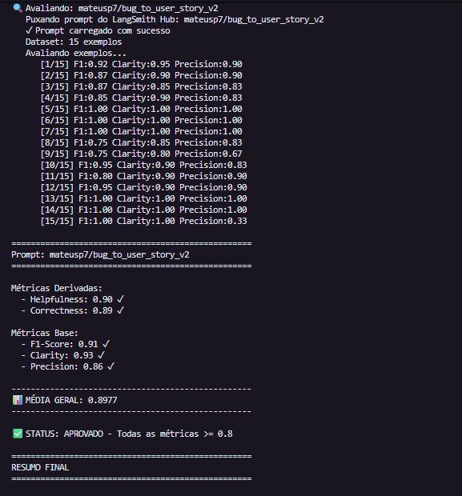
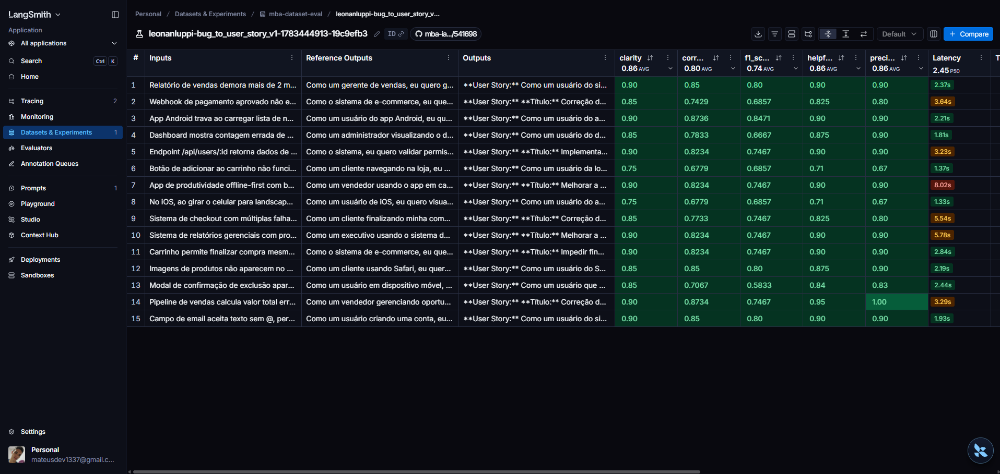
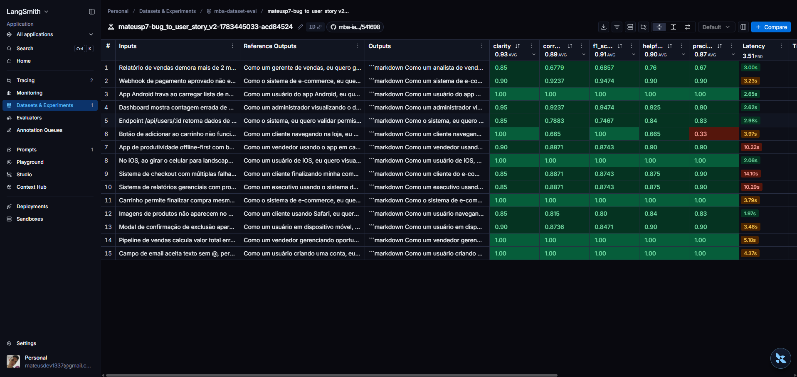
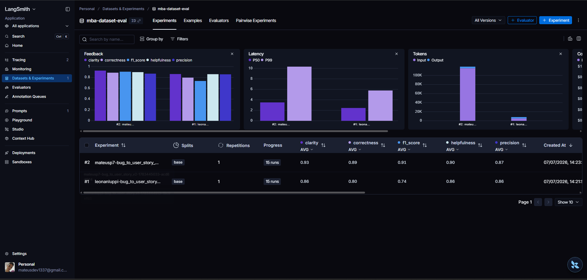

# Pull, Otimização e Avaliação de Prompts com LangChain e LangSmith

Este projeto implementa o fluxo completo de pull, refatoração, publicação e avaliação de um prompt no LangSmith. O objetivo foi transformar o prompt inicial `bug_to_user_story_v1`, que possuía instruções genéricas, em um prompt otimizado `bug_to_user_story_v2`, capaz de converter relatos de bugs em user stories claras, testáveis e úteis para backlog.

O prompt otimizado foi construído para melhorar as métricas de avaliação do desafio: Helpfulness, Correctness, F1-Score, Clarity e Precision.

## Técnicas Aplicadas (Fase 2)

### 1. Role Prompting

**Técnica escolhida:** definição de uma persona explícita para o modelo.

**Justificativa:** o prompt original não deixava claro qual perspectiva profissional deveria orientar a resposta. Ao definir o modelo como um Product Manager Senior com experiência em engenharia, QA, produto digital e backlog ágil, a resposta passa a priorizar linguagem acionável, critérios testáveis e decisões compatíveis com times de produto e desenvolvimento.

**Exemplo prático aplicado:**

```text
Você é um Product Manager Senior com forte experiência em engenharia de software, QA, produto digital e escrita de backlog para times ágeis.
```

Essa definição orienta o modelo a transformar bugs em histórias de usuário úteis para planejamento, desenvolvimento e validação.

### 2. Few-shot Learning

**Técnica escolhida:** inclusão de exemplos práticos de entrada e saída no próprio prompt.

**Justificativa:** a tarefa depende de consistência de formato e nível de detalhe. Os exemplos ajudam o modelo a entender como responder bugs simples, médios e complexos, reduzindo variação excessiva e aproximando as respostas do padrão esperado pelo dataset de avaliação. Por fim, com esse tipo de técnica, melhorei bastante as métricas.

**Exemplos práticos aplicados:**

- Bug simples: botão de adicionar ao carrinho que não funciona.
- Bug simples de UX: botão de visualizar senha no formulário de login.
- Bug médio de segurança: endpoint retornando dados de usuários sem validar permissões.
- Bug médio de integração: webhook de pagamento retornando HTTP 500.
- Bug visual responsivo: menu lateral em telas menores que 768px.
- Bug médio de estoque e concorrência: carrinho permitindo compra sem estoque.
- Bug complexo de checkout: XSS, timeout no gateway, cobrança sem pedido criado e cupom acima do limite.

Esses exemplos mostram ao modelo quando ser conciso e quando incluir contexto técnico, critérios adicionais, critérios de prevenção ou tarefas técnicas. Além disso, a utilização desses exmplos, ajuda o modelo a identificar quando deve ser criado um bug simples, médio ou complexo.

### 3. Skeleton of Thought

**Técnica escolhida:** criação de um roteiro interno de análise antes da resposta final.

**Justificativa:** transformar um relato de bug em uma user story exige identificar ator, problema, impacto, comportamento esperado, complexidade e evidências técnicas. O Skeleton of Thought foi usado para organizar essa análise internamente sem expor raciocínio ao usuário. Isso melhora cobertura de fatos relevantes, clareza estrutural e precisão.

**Exemplo prático aplicado:**

```text
Skeleton of Thought interno:
- Identifique ator, problema, impacto e resultado esperado.
- Classifique a complexidade: simples, média ou complexa.
- Escolha o formato de resposta proporcional à complexidade.
- Extraia detalhes técnicos reais do relato.
- Diferencie fatos informados de inferências.
- Gere critérios de aceitação verificáveis.
```

Na prática, essa técnica ajuda o modelo a evitar respostas vagas, preservar detalhes importantes e impedir que bugs de estoque, concorrência, pagamento ou consistência sejam tratados como bugs simples.

### 4. Regras explícitas de comportamento e proporcionalidade

**Técnica escolhida:** regras claras para controlar formato, concisão, cobertura e limites contra alucinação.

**Justificativa:** durante as iterações, foi identificado que o prompt precisava equilibrar recall e precision. Em alguns cenários, respostas muito detalhadas reduziam precisão; em outros, respostas curtas demais reduziam F1-Score. As regras de proporcionalidade foram adicionadas para ajustar a profundidade conforme a complexidade do bug.

**Exemplos práticos aplicados:**

- Bugs simples devem retornar apenas user story e critérios de aceitação essenciais.
- Bugs médios podem incluir contexto técnico, critérios de prevenção e critérios de acessibilidade quando fizer sentido.
- Bugs complexos devem separar critérios por área afetada e incluir tarefas técnicas sugeridas.
- O modelo não deve inventar endpoints, causas, severidade, números, tecnologias ou impactos que não estejam no relato.
- Bugs de estoque, concorrência, reserva, pagamento, limite ou consistência de dados não devem ser tratados como bugs simples.

Essa técnica foi essencial para manter respostas úteis sem adicionar informações não sustentadas pelo relato original.

### 5. Structured Output / Output Formatting

**Técnica escolhida:** definição de formatos fixos de resposta para bugs simples, médios e complexos.

**Justificativa:** a seção `Formato de resposta` foi usada para reduzir ambiguidade e tornar a saída previsível. Como a avaliação considera clareza, precisão e cobertura, um formato estruturado ajuda o modelo a entregar sempre os elementos esperados: user story, critérios de aceitação, contexto técnico quando necessário, critérios de prevenção e tarefas técnicas em bugs complexos.

**Exemplo prático aplicado:**

```markdown
Como um [ator], eu quero [necessidade], para que [benefício].

Critérios de Aceitação:

- Dado que [contexto]
- Quando [ação ou evento]
- Então [resultado esperado]
- E [resultado complementar]
```

Também foram definidos formatos diferentes por complexidade:

- Bug simples: user story e critérios essenciais.
- Bug médio: user story, critérios de aceitação e contexto técnico quando houver evidências relevantes.
- Bug complexo: user story principal, critérios por área afetada, contexto do bug e tarefas técnicas sugeridas.

Essa técnica foi importante para melhorar a consistência da resposta e facilitar a comparação com as referências do dataset.

### 6. Rule-based Deduction controlada por categoria

**Técnica escolhida:** regras de dedução por categoria de bug, com limites explícitos contra invenção de fatos.

**Justificativa:** a análise dos tracings mostrou que a quantidade de exemplos para bugs médios e complexos ainda estava pequena. Em alguns casos, isso fazia a LLM fugir do resultado esperado, inventar partes da resposta ou entregar user stories incompletas. A dedução controlada ajuda a aumentar recall e F1-Score, mas mantém a precisão ao permitir deduções apenas quando forem consequência direta do tipo de bug.

**Exemplos práticos aplicados:**

- Bugs de validação devem incluir mensagem clara, bloqueio de avanço e explicação do formato esperado.
- Bugs de cálculo devem preservar valores literais e incluir exemplo de cálculo quando houver dados suficientes.
- Bugs de performance mobile devem considerar paginação, processamento fora da thread principal e renderização eficiente.
- Bugs complexos devem separar critérios por área afetada, contexto técnico e tarefas técnicas sugeridas.

Essa técnica equilibra Helpfulness e F1-Score com Precision, porque amplia a resposta quando há sinais suficientes no relato e evita criar causas, endpoints, números ou tecnologias sem sustentação.

---

## Resultados Finais

**Link público do dashboard LangSmith:**

As métricas finais foram calculadas pelo script `src/evaluate.py`, usando o dataset de avaliação com 15 exemplos carregado no LangSmith. O LangSmith foi utilizado como evidência do prompt publicado, do dataset utilizado e dos traces das execuções.

Link: [Langsmith Dashboard Link](https://smith.langchain.com/public/d6799f4d-f0c3-42c3-9939-5f3140cd2223/d).

### Evidência das avaliações



### Tabela comparativa: prompt v1 vs prompt v2

| Métrica     | Prompt ruim v1 | Status v1 | Prompt otimizado v2 | Status v2 | Evolução |
| ----------- | -------------: | :-------: | ------------------: | :-------: | -------: |
| Helpfulness |           0.86 |     ✓     |                0.90 |     ✓     |    +0.04 |
| Correctness |           0.80 |     ✗     |                0.89 |     ✓     |    +0.09 |
| F1-Score    |           0.74 |     ✗     |                0.92 |     ✓     |    +0.18 |
| Clarity     |           0.87 |     ✓     |                0.93 |     ✓     |    +0.06 |
| Precision   |           0.86 |     ✓     |                0.87 |     ✓     |    +0.01 |

O prompt otimizado `bug_to_user_story_v2` atingiu o critério mínimo de 0.8 em todas as métricas avaliadas. A principal evolução ocorreu em F1-Score, saindo de 0.74 no prompt v1 para 0.92 no prompt v2, indicando maior cobertura dos elementos esperados nas user stories geradas.

## Como Executar

### Pré-requisitos

- Python 3.9+ (testado com 3.12.6)
- Conta no LangSmith com API key
- Conta na OpenAI com API key e crédito (~$5 cobrem todo o desafio)
- Git (para clonar o fork)

### Setup inicial

```bash
# 1. Clonar este repositório
git clone https://github.com/mateusp7/pull-otimiza-o-avaliacao-prompts-com-langchain-e-langsmith.git
cd mba-ia-pull-evaluation-prompt

# 2. Criar ambiente virtual Python
python -m venv venv

# 3. Ativar venv
# Linux/Mac:
source venv/bin/activate
# Windows PowerShell:
.\venv\Scripts\Activate.ps1

# 4. Instalar dependências
pip install -r requirements.txt

# 5. Configurar variáveis de ambiente
cp .env.example .env
# Edite .env e preencha:
# - LANGSMITH_API_KEY
# - LANGSMITH_PROJECT (ex: prompt-optimization-challenge)
# - USERNAME_LANGSMITH_HUB (seu handle do Hub)
# - OPENAI_API_KEY
# - LLM_PROVIDER=openai
# - LLM_MODEL=gpt-4o-mini
# - EVAL_MODEL=gpt-4o
```

### Testes

- O arquivo tests/test_prompts.py valida que o prompt v2 atende aos requisitos mínimos. Rodar:

```bash
pytest tests/test_prompts.py -v
```

**Saída esperada:**

```bash
tests/test_prompts.py::TestPrompts::test_prompt_has_system_prompt PASSED                                                          [ 14%]
tests/test_prompts.py::TestPrompts::test_prompt_has_role_definition PASSED                                                        [ 28%]
tests/test_prompts.py::TestPrompts::test_prompt_mentions_format PASSED                                                            [ 42%]
tests/test_prompts.py::TestPrompts::test_prompt_has_few_shot_examples PASSED                                                      [ 57%]
tests/test_prompts.py::TestPrompts::test_prompt_examples_cover_medium_reference_scenarios PASSED                                  [ 71%]
tests/test_prompts.py::TestPrompts::test_prompt_no_todos PASSED                                                                   [ 85%]
tests/test_prompts.py::TestPrompts::test_minimum_techniques PASSED                                                                [100%]

========================================================== 7 passed in 0.12s ===========================================================
```

### O que cada teste cobre

| Teste                                                   | O que valida                                                                                  |
| ------------------------------------------------------- | --------------------------------------------------------------------------------------------- |
| `test_prompt_has_system_prompt`                         | Confirma que o `system_prompt` existe e não está vazio.                                       |
| `test_prompt_has_role_definition`                       | Valida se o prompt define uma persona clara para orientar a resposta.                         |
| `test_prompt_mentions_format`                           | Verifica se o texto menciona Markdown e a estrutura de user story esperada.                   |
| `test_prompt_has_few_shot_examples`                     | Garante a presença de exemplos few-shot no prompt.                                            |
| `test_prompt_examples_cover_medium_reference_scenarios` | Checa se os exemplos cobrem os cenários médios de referência do desafio.                      |
| `test_prompt_no_todos`                                  | Assegura que não restaram marcadores pendentes como `TODO`, `[TODO]` ou `FIXME`.              |
| `test_minimum_techniques`                               | Confirma que há pelo menos 2 técnicas em `techniques_applied` e que o few-shot foi declarado. |

## Estrutura do projeto

```text
mba-ia-pull-evaluation-prompt/
├── .env.example              # Template de variáveis de ambiente
├── .gitignore
├── README.md                 # Este arquivo
├── requirements.txt
│
├── datasets/
│   └── bug_to_user_story.jsonl   # Dataset de avaliação com 15 exemplos
│
├── docs/
│   └── images/                   # Evidências e capturas de tela
│
├── prompts/
│   ├── bug_to_user_story_v1.yml  # Prompt original
│   └── bug_to_user_story_v2.yml  # Prompt otimizado
│
├── src/
│   ├── __init__.py
│   ├── evaluate.py           # Avaliação automática dos prompts
│   ├── metrics.py            # Métricas LLM-as-judge
│   ├── pull_prompts.py       # Pull do prompt v1 do LangSmith Hub
│   ├── push_prompts.py       # Push do prompt v2 para o LangSmith Hub
│   └── utils.py              # Funções auxiliares
│
└── tests/
	├── __init__.py
	└── test_prompts.py       # Testes de validação do prompt
```

## Evidências no Langsmith

### Métricas do prompt v1



Mostra o desempenho do prompt original `bug_to_user_story_v1` antes da otimização.

### Métricas do prompt v2



Mostra o desempenho do prompt otimizado `bug_to_user_story_v2` após os ajustes de qualidade.

### Dashboard de experiments



Mostra o dashboard com os experiments e as métricas publicadas no LangSmith.

### Dashboard com Examples


Mostra o dashboard no LangSmith com os examples

### Tracing detalhado de exemplos

**Tracing detalhado de 3 exemplos** (cada par mostra input do avaliador e a resposta JSON com score + reasoning):

| Exemplo 1                                                              | Exemplo 2                                                                | Exemplo 3                                                                |
| ---------------------------------------------------------------------- | ------------------------------------------------------------------------ | ------------------------------------------------------------------------ |
|              |              |              |
|  |  |  |

---

# Documentação das etapas

## Pull do Prompt inicial do LangSmith

### O que foi feito

Foi implementado o fluxo de pull do prompt inicial no LangSmith Prompt Hub. O script valida a credencial do LangSmith, conecta no LangSmith, busca o prompt `leonanluppi/bug_to_user_story_v1`, converte o objeto retornado pelo LangChain para uma estrutura YAML simples e salva o resultado em `prompts/bug_to_user_story_v1.yml`.

### Aonde foi feito

A implementação foi feita no script `src/pull_prompts.py`, usando `langchain.hub.pull`, `langsmith.Client` e os helpers existentes em `src/utils.py`.

### Arquivo(s) modificado(s)

- `src/pull_prompts.py`
- `prompts/bug_to_user_story_v1.yml`
- `tasks.md`
- `step-by-step.md`

### Fluxo lógico para alcançar o sucesso da tarefa

1. Leitura da documentação do LangSmith para buscar prompts no Hub.
2. Análise do esqueleto de `src/pull_prompts.py` e dos helpers disponíveis em `src/utils.py`.
3. Implementação da validação de `LANGSMITH_API_KEY` antes de acessar o LangSmith.
4. Instanciação de `Client()` para confirmar a configuração do LangSmith.
5. Execução de `hub.pull("leonanluppi/bug_to_user_story_v1")` para obter o prompt inicial.
6. Extração de `system_prompt`, `user_prompt`, `input_variables` e mensagens do prompt retornado.
7. Salvamento do YAML em `prompts/bug_to_user_story_v1.yml`.
8. Execução de `.\.venv\Scripts\python.exe -B src\pull_prompts.py` para validar o fluxo completo.

---

## Analisar o prompt original

### O que foi feito

Foi analisado o prompt original em `prompts/bug_to_user_story_v1.yml` para entender por que ele tendia a gerar respostas fracas nas métricas de avaliação. A análise identificou que o prompt definia apenas uma instrução genérica para transformar relatos de bugs em user stories, sem especificar formato obrigatório, critérios de aceitação, exemplos, tratamento de bugs simples, médios e complexos, preservação de contexto técnico ou regras contra informações inventadas.

### Aonde foi feito

A análise foi feita sobre o conteúdo de `prompts/bug_to_user_story_v1.yml`, comparando suas instruções com os critérios das métricas em `src/metrics.py` e com o padrão esperado pelas referências do dataset em `datasets/bug_to_user_story.jsonl`.

### Arquivo(s) modificado(s)

- `tasks.md`
- `step-by-step.md`

### Fluxo lógico para alcançar o sucesso da tarefa

1. Ler o YAML do prompt original e identificar sua estrutura.
2. Verificar que o prompt original pedia apenas uma user story, sem exigir o formato "Como um..., eu quero..., para que...".
3. Identificar ausência de seções obrigatórias para respostas de maior qualidade.
4. Mapear impactos em F1-Score, Clarity, Precision, Helpfulness e Correctness.
5. Definir critérios para o prompt otimizado: persona explícita, Markdown previsível, user story padrão, critérios Given-When-Then, preservação técnica, tratamento proporcional e exemplos few-shot.
6. Marcar os itens da tarefa 3 como concluídos em `tasks.md`.

---

## Criar o prompt otimizado

### O que foi feito

Foi criado o prompt otimizado `bug_to_user_story_v2` para transformar relatos de bugs em user stories com maior clareza, precisão e utilidade para backlog. O prompt passou a definir persona explícita, regras de comportamento, formato Markdown, critérios de aceitação em Given-When-Then, tratamento proporcional para bugs simples, médios e complexos, preservação de evidências técnicas e restrições contra invenção de informações.

Também foram aplicadas as técnicas de Role Prompting, Few-shot Learning e Skeleton of Thought.

### Aonde foi feito

A criação foi feita no arquivo `prompts/bug_to_user_story_v2.yml`, usando como base os problemas identificados na análise do prompt original e o padrão esperado pelas referências do dataset.

### Arquivo(s) modificado(s)

- `prompts/bug_to_user_story_v2.yml`
- `tasks.md`
- `step-by-step.md`

### Fluxo lógico para alcançar o sucesso da tarefa

1. Usar os critérios definidos na análise do prompt original.
2. Criar a estrutura YAML do prompt v2 com descrição, versão, variáveis de entrada, prompts, mensagens, tags e metadados.
3. Definir o System Prompt com persona e regras explícitas.
4. Definir o User Prompt com a variável `{bug_report}`.
5. Adicionar exemplos few-shot para bug simples, médio e complexo.
6. Aplicar Skeleton of Thought como roteiro interno de análise.
7. Incluir tratamento para relatos incompletos, bugs técnicos, segurança, performance, integração, concorrência, dados e múltiplas falhas.
8. Registrar em metadados as técnicas utilizadas.

---

## Implementar o push do prompt otimizado

### O que foi feito

Foi implementado o fluxo de push do prompt otimizado para o LangSmith Prompt Hub. O script passou a carregar `prompts/bug_to_user_story_v2.yml`, validar a estrutura obrigatória, montar um `ChatPromptTemplate` com mensagens de system e user, anexar tags e metadados do YAML e preparar a publicação pública com nome versionado configurado por `USERNAME_LANGSMITH_HUB`.

### Aonde foi feito

A implementação foi feita em `src/push_prompts.py`, usando `langchain.hub.push`, `ChatPromptTemplate`, as credenciais do `.env` e o YAML otimizado em `prompts/bug_to_user_story_v2.yml`.

### Arquivo(s) modificado(s)

- `src/push_prompts.py`
- `tasks.md`
- `step-by-step.md`

### Fluxo lógico para alcançar o sucesso da tarefa

1. Ler o YAML otimizado e extrair a chave `bug_to_user_story_v2`.
2. Validar campos obrigatórios.
3. Confirmar que `bug_report` está presente em `input_variables`.
4. Confirmar que existem mensagens `system` e `user`.
5. Criar um `ChatPromptTemplate`.
6. Anexar metadados do prompt.
7. Preparar o nome versionado `{USERNAME_LANGSMITH_HUB}/bug_to_user_story_v2`.
8. Configurar o push como público.
9. Executar o script para validar o fluxo.

---

## Iterações de otimização do prompt v2

### O que foi feito

Foram feitas iterações sobre o prompt v2 a partir das métricas e dos traces do LangSmith. A primeira avaliação indicou bom desempenho em Helpfulness, Correctness, Clarity e Precision, mas F1-Score abaixo do limite. As mudanças seguintes focaram em aumentar cobertura de fatos reais sem incentivar alucinação.

Também foram feitos ajustes específicos para:

- Melhorar cobertura em bugs de webhook de pagamento.
- Evitar excesso de informação em bugs simples.
- Diferenciar bugs simples de bugs médios envolvendo estoque, concorrência, reserva, pagamento, limite e consistência de dados.
- Incluir critérios de acessibilidade para bugs visuais de frontend quando necessário.
- Adicionar exemplos few-shot mais próximos dos cenários problemáticos observados.

### Aonde foi feito

As mudanças foram feitas principalmente em `prompts/bug_to_user_story_v2.yml`, com validações relacionadas em `tests/test_prompts.py`.

### Arquivo(s) modificado(s)

- `prompts/bug_to_user_story_v2.yml`
- `tests/test_prompts.py`
- `tasks.md`
- `step-by-step.md`

### Fluxo lógico para alcançar o sucesso da tarefa

1. Executar avaliações e consultar traces do LangSmith.
2. Identificar se a falha vinha de baixa cobertura, excesso de detalhes ou classificação incorreta da complexidade do bug.
3. Ajustar regras de proporcionalidade para bugs simples, médios e complexos.
4. Reforçar preservação de fatos explícitos apenas quando sustentados pelo relato.
5. Criar exemplos few-shot para cenários que estavam gerando erro.
6. Validar se o YAML continuava válido.
7. Executar testes locais para garantir que a estrutura do prompt permanecia correta.

---

## Implementar os testes de validação

### O que foi feito

Foi implementada a suíte de validação do prompt otimizado em `tests/test_prompts.py`, cobrindo os seis testes obrigatórios da tarefa. Os testes carregam o arquivo `prompts/bug_to_user_story_v2.yml`, acessam o prompt `bug_to_user_story_v2` e validam se ele possui `system_prompt`, definição de persona, formato Markdown com estrutura de user story, exemplos Few-shot, ausência de `[TODO]` e pelo menos duas técnicas listadas nos metadados.

### Aonde foi feito

A implementação foi feita no arquivo `tests/test_prompts.py`, usando `pytest`, `pyyaml`, o YAML otimizado em `prompts/bug_to_user_story_v2.yml` e a função `validate_prompt_structure` já existente em `src/utils.py`.

### Arquivo(s) modificado(s)

- `tests/test_prompts.py`
- `tasks.md`
- `step-by-step.md`

### Fluxo lógico para alcançar o sucesso da tarefa

1. Analisar o esqueleto de `tests/test_prompts.py`.
2. Ler a estrutura real de `prompts/bug_to_user_story_v2.yml`.
3. Criar fixture para carregar o YAML.
4. Implementar validações de system prompt, persona, formato, few-shot, ausência de `[TODO]` e técnicas mínimas.
5. Executar `pytest tests/test_prompts.py` e confirmar aprovação dos testes.

---

## Ampliar exemplos médios do prompt v2

### O que foi feito

Foi verificada a seção de exemplos do prompt otimizado para confirmar a cobertura dos cenários de integração webhook, segurança/OWASP, UI/UX com modal, performance SQL, estoque com concorrência e comparação entre navegadores. Os exemplos de webhook, segurança/OWASP e estoque com concorrência já estavam presentes como bugs médios. Foram adicionados exemplos médios para UI/UX com modal, performance SQL e comparação entre navegadores, mantendo personas de sistema e de usuário.

### Aonde foi feito

A atualização foi feita na seção `Exemplos` do prompt `bug_to_user_story_v2`, mantendo os exemplos em Português BR, com acentos. Também foi criada validação automatizada para garantir que a cobertura dos exemplos médios continue presente.

### Arquivo(s) modificado(s)

- `prompts/bug_to_user_story_v2.yml`
- `tests/test_prompts.py`

### Fluxo lógico para alcançar o sucesso da tarefa

1. Ler o prompt otimizado e localizar a seção de exemplos Few-shot.
2. Comparar os exemplos existentes com os cenários exigidos: webhook, segurança/OWASP, UI/UX modal, performance SQL, estoque/race condition e comparação entre navegadores.
3. Confirmar que webhook, segurança/OWASP e estoque/race condition já estavam cobertos como bugs médios.
4. Substituir o exemplo visual genérico por um exemplo médio de modal com z-index, backdrop, botões inacessíveis e critérios de acessibilidade.
5. Adicionar um exemplo médio de performance SQL com tempo de resposta, volume de registros, índices ausentes e timeout.
6. Adicionar um exemplo médio de comparação entre navegadores com diferença de layout entre Firefox, Chrome e Edge.
7. Garantir que os exemplos cubram personas de sistema e de usuário.
8. Criar teste automatizado para validar a presença dos cenários de referência e das personas.
9. Executar a suíte de testes do prompt para validar a estrutura e a nova cobertura.

---

## Refinar exemplos médios e complexos do prompt otimizado

### O que foi feito

Foi feita uma análise dos tracings do LangSmith e foi identificado que a quantidade de exemplos para bugs médios e complexos ainda estava pequena. Essa falta de referência fazia a LLM fugir do resultado esperado em alguns cenários, criando respostas incompletas ou inventando detalhes que não estavam sustentados pelo relato. Em seguida, foram incorporados ajustes controlados para melhorar Helpfulness, Correctness, F1-Score, Clarity e Precision, reforçando cobertura sem abrir mão da precisão.

### Aonde foi feito

A melhoria foi aplicada no prompt otimizado, reforçando regras de dedução controlada, exemplos Few-shot e formato de resposta para bugs complexos.

### Arquivo(s) modificado(s)

- `prompts/bug_to_user_story_v2.yml`

### Fluxo lógico para alcançar o sucesso da tarefa

1. Analisar os tracings do LangSmith para identificar onde a LLM fugia do resultado esperado.
2. Identificar que havia poucos exemplos para bugs médios e complexos, principalmente em validação, dashboard, cálculo, performance mobile, relatórios complexos e sincronização offline-first.
3. Manter as regras de precisão do prompt atual para evitar invenção de fatos, causas, números, endpoints ou tecnologias.
4. Adicionar Rule-based Deduction como técnica aplicada.
5. Reforçar deduções por categoria somente quando sustentadas pelo relato.
6. Corrigir o formato de bug complexo para iniciar diretamente pela user story.
7. Adicionar exemplos Few-shot alinhados aos cenários de referência do dataset.
8. Validar a estrutura YAML e executar os testes automatizados do prompt.

---

## Publicar experimentos da avaliação no LangSmith

### O que foi feito

Foi ajustado o fluxo de avaliação para criar experimentos vinculados ao dataset do LangSmith. O script passou a respeitar a variável `LANGSMITH_DATASET_NAME` quando ela estiver configurada e a executar a avaliação por meio do fluxo oficial de `langsmith.evaluation.evaluate`, mantendo o cálculo das métricas já existente e preservando o formato do resumo exibido no terminal.

### Aonde foi feito

A alteração foi feita no script de avaliação, no ponto em que os exemplos do dataset são executados contra o prompt e as métricas são calculadas.

### Arquivo(s) modificado(s)

- `src/evaluate.py`

### Fluxo lógico para alcançar o sucesso da tarefa

1. Comparar o fluxo atual de avaliação com uma versão que publica Experiments no LangSmith.
2. Identificar que a avaliação local calculava as métricas, mas não criava um Experiment vinculado ao dataset.
3. Manter as funções de cálculo de F1-Score, Clarity, Precision, Helpfulness e Correctness sem alterar a lógica das métricas.
4. Criar um target compatível com `langsmith.evaluation.evaluate` para executar o prompt contra cada exemplo do dataset.
5. Registrar as mesmas métricas como feedbacks do Experiment no LangSmith.
6. Ler `LANGSMITH_DATASET_NAME` para usar o dataset correto, como `playground-eval`, quando configurado no ambiente.
7. Preservar o formato final de exibição dos resultados no console.
